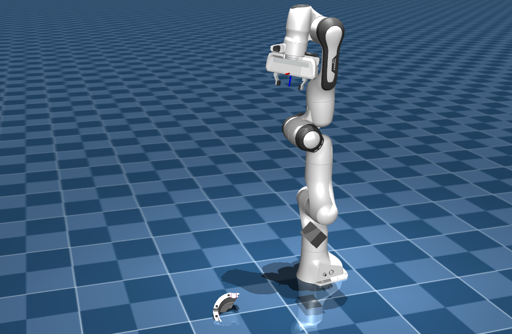
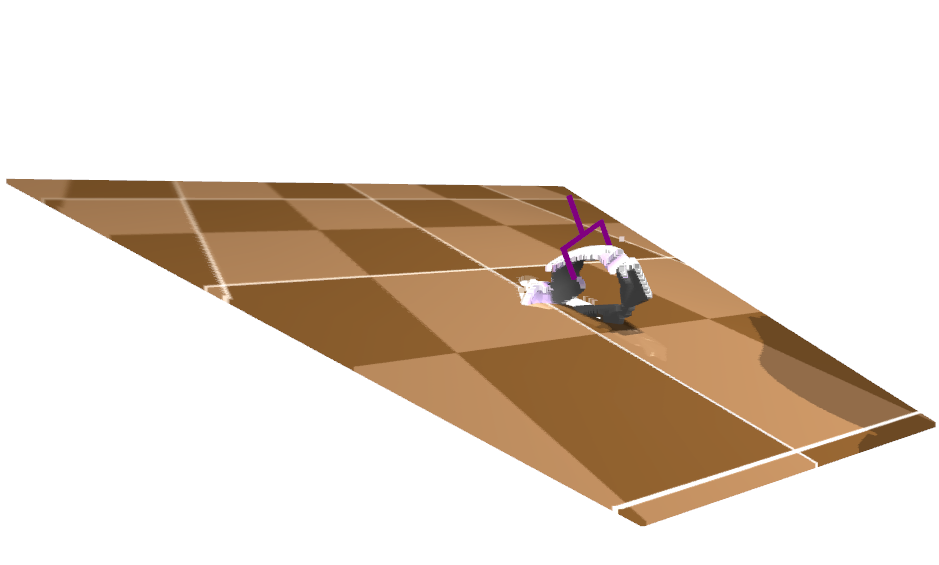
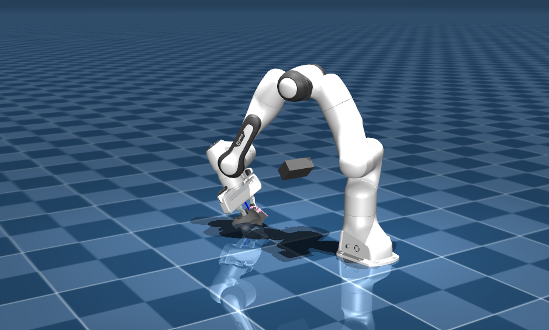

# sim_gen — симуляция захвата объектов манипулятором panda в MuJoCo


*MuJoCo‑powered grasp‑pipeline: камера → облако → SBG → CV‑grasp → IK Panda → захват и подъём.*



---

## 1 · Что это

В этом репозитории реализован полный пайплайн захвата детали в физическом движке **MuJoCo 3.x**:

- Скрипт `run_grasp.py` считывает RGB‑D изображение, строит цветное облако точек (Open3D) и показывает поток RGB (OpenCV).
- Облако отправляется на SBG‑сервер с CV‑моделью захватов.
- Лучший grasp преобразуется из системы координат камеры в систему робота, планируется траектория через IK Panda.
- Логируются ошибки, выполняется сценарий: открыть → подъехать → закрыть до порога силы → пауза → подъём детали → разжать.
- Сцена описана в `scene/` (MJCF + 3D‑модели в `scene/assets/`).
- Калибровочные файлы лежат в `calib/`.

---

## 2 · Зависимости

- **Python ≥ 3.9**
- **MuJoCo ≥ 3.1** — `pip install mujoco`
- **Open3D**, **OpenCV**, **NumPy**, **spatialmath**
- **msgpack**, **msgpack‑numpy** (для клиент‑сервера обмена)
- (опционально) **Git LFS** — если храните тяжёлые ассеты в `scene/assets/`

Все пакеты в `requirements.txt` можно установить одной командой:

```bash
pip install -r requirements.txt
```

---

## 3 · Быстрый старт

```bash
# Клонируем репозиторий
git clone https://github.com/<ваш_пользователь>/sim_d435.git
cd sim_d435

# Создаём и активируем виртуальное окружение
python -m venv env && source env/bin/activate

# Устанавливаем зависимости
pip install -r requirements.txt

# Запускаем пайплайн захвата
python run_grasp.py
```

После запуска откроются окна `RGB` и `Cloud`; при удачном захвате манипулятор поднимет деталь.

---

## 4 · Структура

```plaintext
.
├── calib/                  # результаты калибровки
│   └── last_calib.npz
├── scene/                  # MJCF‑сцена и ассеты
│   ├── assets/             # .obj/.stl модели объектов
│   ├── camera_d435.xml
│   ├── panda.xml
│   └── scene.xml
├── simlib/                 # вспомогательные модули: config, transforms, IK, gripper…
│   ├── config.py
│   ├── gripper.py
│   ├── ik_driver.py
│   ├── mujoco_io.py
│   ├── mujoco_render.py
│   ├── sbg_client.py
│   ├── tcp_eval.py
│   ├── transforms.py
│   └── …
├── run_grasp.py            # основной скрипт пайплайна захвата
└── README.md
```

---

## 5 · Ключевые настройки (`simlib/config.py`)

| Параметр          | По умолчанию        | Описание                                      |
| ----------------- | ------------------- | --------------------------------------------- |
| `XML`             | `"scene/scene.xml"` | Путь к MJCF‑сцене                             |
| `WIDTH, HEIGHT`   | `640, 480`          | Размеры off‑screen рендеринга облака          |
| `SETTLE_SEC`      | `1.0`               | Время ожидания сцены (сек)                    |
| `SLEEP_BETWEEN`   | `0.5`               | Пауза между итерациями цикла (сек)            |
| `GRIPPER_OPEN_M`  | `0.08`              | Макс. ширина ЗУ (м)                   |
| `GRIPPER_CLOSE_M` | `0.00`              | Мин. ширина ЗУ (м)                    |
| `F_THRESH`        | `150.0`             | Порог силы для остановки закрытия (N)         |
| `DO_IK`           | `True`              | Включить движение через IK                    |
| `USE_TCP_TIP`     | `False`             | Учесть смещение от TCP до конечной точки ЗУ |

Изменяйте значения прямо в `simlib/config.py` или через переменные окружения.

---

## 6 · Повторная установка окружения

```bash
python -m venv env
source env/bin/activate
pip install -r requirements.txt
```

---

---

## 7 · Запуск

Запуск инференса SBG:
```bash
bash sim_go.sh
```
Запуск симуляции:
```bash
python run_grasp.py 
```
Для отправки значений в симуляцию закрыть оконо отображения сгенерированного захвата в инференсе.



После этого манипулятор перейдет в эту точку.


---

## 7 · To Do

- 🎮 Добавить CLI‑аргументы вместо хардкода
- 🖼️ Рандомизация поз и материалов для генерации датасетов
- 📦 Dockerfile + CI для автоматических сборок

